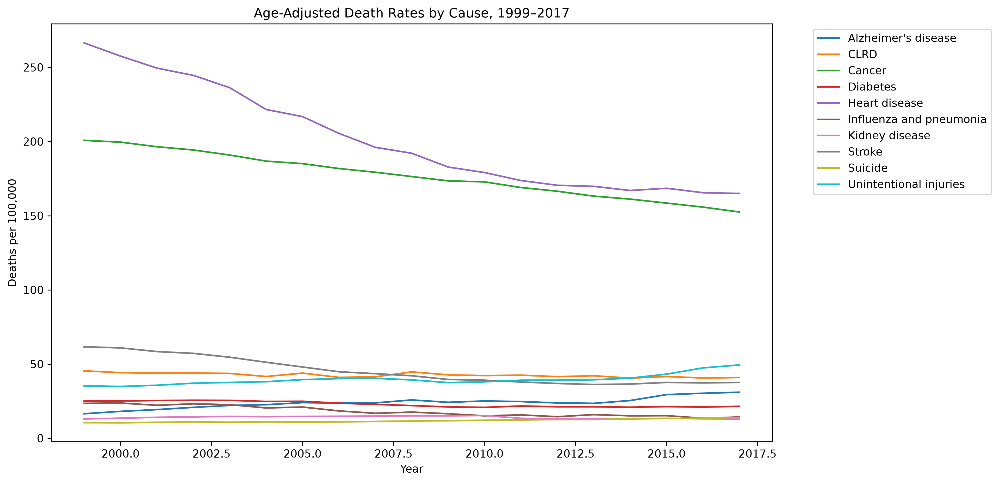
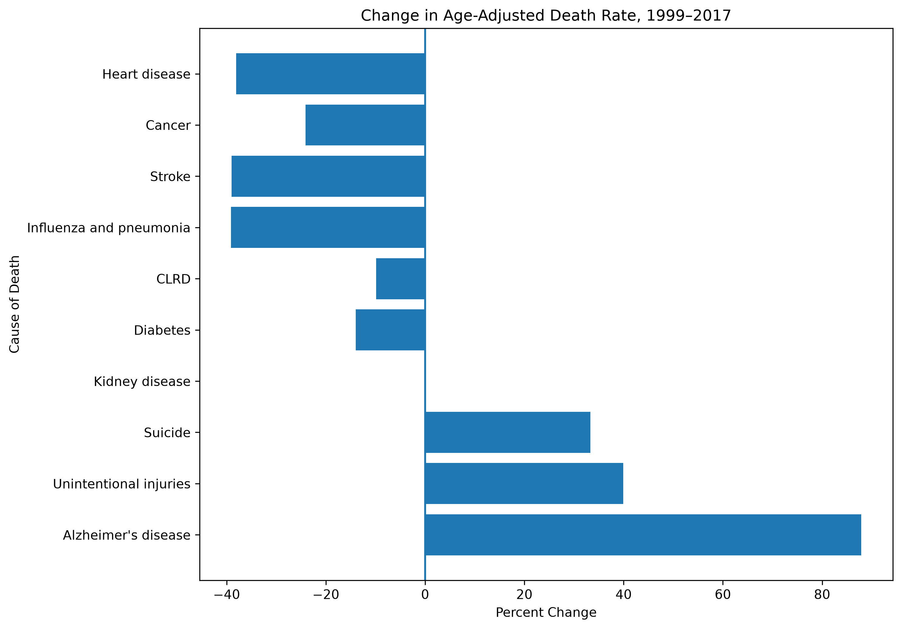
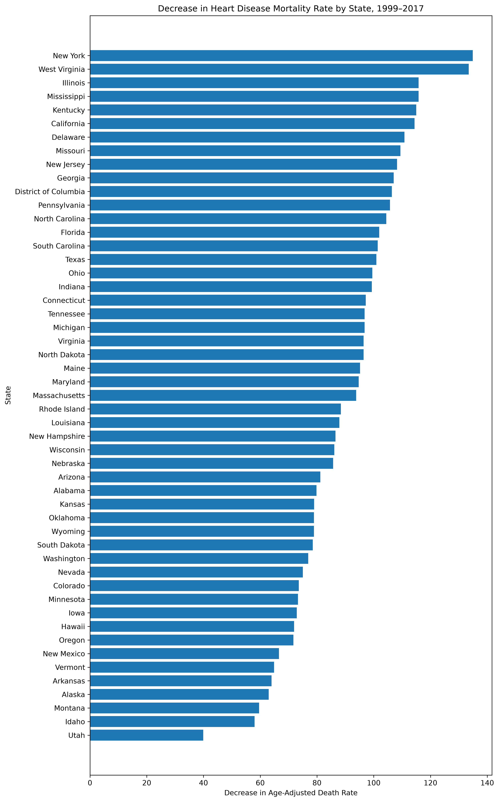

# NCHS Leading Causes of Death Analysis

## Overview

This project analyzes trends in the leading causes of death in the United States using data from the National Center for Health Statistics (NCHS).

The goal is to explore how mortality rates and rankings changed over time and identify notable patterns that could be relevant to public-health decision making.

The project intentionally uses two analytical tools — **SQL and Python/Pandas** — to strengthen my ability to approach the same analytical questions in different environments.

**Research Questions → Data Validation → SQL Analysis → Python/Pandas EDA → Visualization → Findings**

---

## Research Questions

This analysis focuses on:

1. **How have age-adjusted mortality rates changed over time for the leading causes of death?**

2. **Which causes of death experienced the largest increases or decreases in mortality rates?**

3. **How has the ranking of leading causes changed over time?**

4. **Which causes show the most notable long-term trends or changes?**

5. **How did heart disease mortality rates change across states between 1999 and 2017?**

These questions were selected to provide a focused analysis rather than attempting to investigate every available variable.

---

# Dataset

**Source:** National Center for Health Statistics (NCHS)

**Dataset:** Leading Causes of Death: United States

**Time period:** 1999–2017

**Records:** 10,868

### About the Data

The dataset contains information on the 10 leading causes of death in the United States, along with all-cause mortality, across the 50 states, the District of Columbia, and the United States overall.

The primary measure used in this analysis is:

**Age-adjusted death rate per 100,000 population**

Age-adjusted rates allow mortality trends to be compared across years while accounting for differences in population age structure. The rates in this dataset are based on the 2000 U.S. standard population.

The dataset is based on information from resident death certificates and uses the underlying cause of death.

**Source:** [NCHS — Leading Causes of Death in the United States, 1999–2017](https://www.cdc.gov/nchs/data-visualization/mortality-leading-causes/index.htm)

---

# Data Preparation

## Initial Data Inspection

Before analyzing the data, I examined:

* Number of records
* Number of columns
* Data types
* Missing values
* Duplicate records
* Unique causes of death
* Year range
* Geographic coverage
* Numeric validity of mortality values

### Data Quality Findings

The dataset contained **10,868 records across six columns**, covering 1999–2017.

Initial validation found:

* No missing values
* No duplicate records based on year, cause, and state
* 11 cause categories, including all causes combined
* 50 states, the District of Columbia, and the United States as geographic levels
* No non-numeric or blank values in the deaths field after validation
* No unexpected gaps in the year range

The original `Deaths` field was stored as text and required conversion before numerical analysis.

---

## Data Cleaning

The primary cleaning steps were performed in SQL and included:

* Converting the `Deaths` field from text to an integer
* Removing commas from death counts before conversion
* Renaming columns for easier analysis
* Creating a national-level analytical table by filtering to `State = 'United States'`
* Preserving the original raw data separately from the cleaned analytical data

The cleaned national dataset contains **209 records**, representing 19 years × 11 cause categories.

All cleaning and validation decisions are documented in the SQL files.

---

# SQL Analysis

SQL was used to perform the initial data validation, cleaning, aggregation, and analysis.

### SQL Skills Demonstrated

* Filtering
* Aggregation
* `GROUP BY`
* `CASE` statements
* Common table expressions (CTEs)
* Window functions
* `RANK()`
* `LAG()`
* Year-over-year analysis
* Calculated fields
* Sorting and ranking

### Example Analysis

SQL was used to calculate changes in age-adjusted mortality rates between 1999 and 2017, rank causes within each year, and calculate year-over-year changes using window functions.

For example, `LAG()` was used to compare each year's mortality rate with the previous year, allowing unusually large annual changes to be identified.

---

# Python / Pandas Analysis

The raw CSV dataset was also analyzed using Python and Pandas.

The purpose was not simply to repeat the SQL analysis, but to learn how analytical concepts translate between SQL and Python while using Python's additional exploratory capabilities.

### Python Skills Demonstrated

* Loading CSV data with Pandas
* Data inspection
* Data cleaning
* Boolean filtering
* Grouping and aggregation
* Pivoting data
* Sorting and ranking
* Creating calculated fields
* Year-over-year analysis
* Exploratory data analysis
* Data visualization

Python was also used to create national trend visualizations, percentage-change comparisons, ranking visualizations, and a state-level geographic analysis.

---

# SQL vs. Pandas

One goal of this project was to compare how similar analytical tasks can be performed in SQL and Pandas.

| Analytical Task       | SQL              | Pandas              |
| --------------------- | ---------------- | ------------------- |
| Filter records        | `WHERE`          | Boolean filtering   |
| Group data            | `GROUP BY`       | `.groupby()`        |
| Aggregate             | `SUM()`, `AVG()` | `.sum()`, `.mean()` |
| Sort                  | `ORDER BY`       | `.sort_values()`    |
| Join/Combine          | `JOIN`           | `.merge()`          |
| Pivot data            | —                | `.pivot()`          |
| Ranking               | Window functions | `.rank()`           |
| Year-over-year change | `LAG()`          | `.groupby().diff()` |

This comparison helped reinforce analytical concepts rather than focusing solely on memorizing syntax.

---

# Exploratory Data Analysis

## Mortality Trends

The national analysis showed substantial differences in long-term mortality trends across causes.

Heart disease remained the leading cause throughout the entire period, while its age-adjusted death rate declined from **266.5 deaths per 100,000 in 1999 to 165.0 in 2017**, a decrease of approximately **38.1%**.

Cancer also remained ranked second throughout the period, with its age-adjusted rate declining from **200.8 to 152.5**, a decrease of approximately **24.1%**.

In contrast, several causes increased over the period. Alzheimer's disease increased from **16.5 to 31.0 deaths per 100,000**, an **87.9% increase**, while unintentional injuries increased by approximately **39.9%**.

### Visualization



---

## Changes in Ranking

The relative ranking of several causes changed between 1999 and 2017.

Heart disease remained ranked first and cancer remained ranked second throughout the period.

The largest upward movements in ranking were:

* **Alzheimer's disease:** 8th → 6th
* **Unintentional injuries:** 5th → 3rd

Stroke moved in the opposite direction, from **3rd → 5th**.

Ranking reflects the relative position of causes compared with one another, so a change in rank does not necessarily mean that a cause's own mortality rate increased or decreased by the same amount.

### Visualization


---

## Largest Increases / Decreases

Between 1999 and 2017, Alzheimer's disease experienced the largest percentage increase in age-adjusted mortality rate at **87.9%**.

Unintentional injuries increased by **39.9%**, while suicide increased by **33.3%**.

The largest absolute decrease occurred for heart disease, which declined by **101.5 deaths per 100,000**. Cancer declined by **48.3**, while stroke declined by **24.0**.

The analysis also examined year-over-year changes. The largest single-year decline occurred for heart disease between 2003 and 2004, when the rate decreased by **14.7 deaths per 100,000**. The largest single-year increase was a **4.2-point increase in unintentional injury mortality between 2015 and 2016**.

### Visualization



---

## State-Level Heart Disease Analysis

A secondary analysis examined changes in heart disease mortality across the 50 states and the District of Columbia.

Heart disease mortality rates declined in **every state and the District of Columbia** between 1999 and 2017, although the magnitude of the decline varied geographically.

The largest absolute decreases occurred in:

* New York: **−134.9 deaths per 100,000**
* West Virginia: **−133.5**
* Illinois: **−115.8**
* Mississippi: **−115.8**
* Kentucky: **−115.0**

This analysis demonstrates the importance of considering both national trends and geographic variation when examining mortality patterns.

### Visualizations



An interactive geographic version of this analysis is available in [`heart_disease_mortality_map.html`](outputs/charts/heart_disease_mortality_map.html).

---

# Key Findings

### 1. Heart disease mortality declined substantially while remaining the leading cause.

The age-adjusted heart disease mortality rate decreased from **266.5 to 165.0 deaths per 100,000** between 1999 and 2017, a **38.1% decline**. Despite this decline, heart disease remained the leading cause throughout the dataset's entire time period.

### 2. Alzheimer's disease and unintentional injuries showed notable increases.

Alzheimer's disease had the largest percentage increase, rising **87.9%** from 1999 to 2017. Unintentional injuries increased **39.9%** and moved from fifth to third in the ranking.

### 3. Mortality trends varied substantially across causes.

Some causes experienced persistent long-term declines, while others increased or remained relatively stable. Kidney disease, for example, had the same endpoint rate in 1999 and 2017 despite reaching a higher rate during the middle of the period. This illustrates why examining the full time series is important rather than relying only on beginning and ending values.

### 4. Geographic differences were present within the overall decline in heart disease mortality.

Although every state and the District of Columbia experienced a decline in heart disease mortality between 1999 and 2017, the size of those declines varied. This geographic analysis provides additional context beyond the national trend.

---

# Important Considerations

This analysis describes patterns in mortality data but does not establish causal relationships.

Additional considerations include:

* The dataset represents reported mortality statistics based on resident death certificates.
* Age-adjusted rates are used as the primary measure because they improve comparability across years with different population age structures.
* Changes in mortality rates do not necessarily indicate a single underlying cause.
* Leading-cause rankings are relative to other rankable causes, so a cause's rank can change even when its own mortality rate changes little.
* The dataset ends in 2017 and therefore does not capture more recent mortality trends.
* The state-level analysis describes geographic differences but does not investigate why those differences occurred.

---

# Conclusion

The analysis shows that mortality patterns in the United States changed substantially between 1999 and 2017, but those changes were not consistent across causes of death.

Heart disease and cancer remained the two leading causes throughout the period while experiencing substantial declines in age-adjusted mortality rates. In contrast, Alzheimer's disease, unintentional injuries, and suicide increased, with Alzheimer's disease showing the largest percentage increase.

The rankings of several causes also shifted. Alzheimer's disease moved from eighth to sixth, while unintentional injuries moved from fifth to third. Stroke declined from third to fifth.

The state-level heart disease analysis showed that mortality rates declined across every state and the District of Columbia, although the magnitude of those declines varied geographically.

Overall, the project demonstrates the value of combining long-term trend analysis, ranking analysis, and geographic comparisons to understand changes in mortality patterns. It also provided an opportunity to apply the same analytical concepts in both SQL and Python/Pandas while developing data-cleaning and visualization skills.

---

# What I Learned

This project helped me develop:

* SQL EDA skills
* Python/Pandas fundamentals
* Data-cleaning skills
* Data visualization
* Longitudinal analysis
* Geographic data visualization
* Ranking and year-over-year analysis
* Ability to translate analytical logic between SQL and Python
* Ability to distinguish between descriptive findings and causal conclusions

---

# Tools

* SQL
* SQLite
* DBeaver
* Python
* Pandas
* Matplotlib
* Plotly
* Jupyter Notebook
* GitHub

---

# Project Structure

```text
NCHS-Leading-Causes-of-Death-Analysis/
│
├── data/
│   ├── raw/
│   └── processed/
│
├── sql/
│   ├── 01_data_validation.sql
│   ├── 02_data_cleaning.sql
│   └── 03_analysis.sql
│
├── notebooks/
│   └── 01_eda.ipynb
│
├── outputs/
│   └── charts/
│       ├── national_mortality_trends.png
│       ├── mortality_rate_percent_change.png
│       ├── ranking_of_leading_causes.png
│       ├── heart_disease_state_decreases.png
│       └── heart_disease_mortality_map.html
│
├── README.md
├── pyproject.toml
└── .gitignore
```
